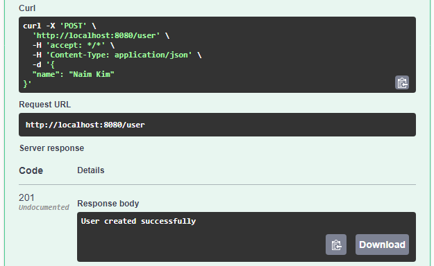
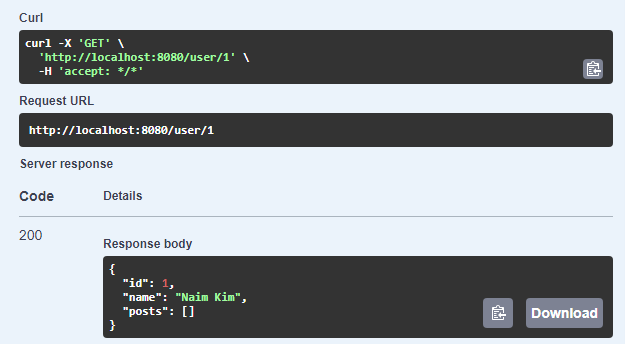
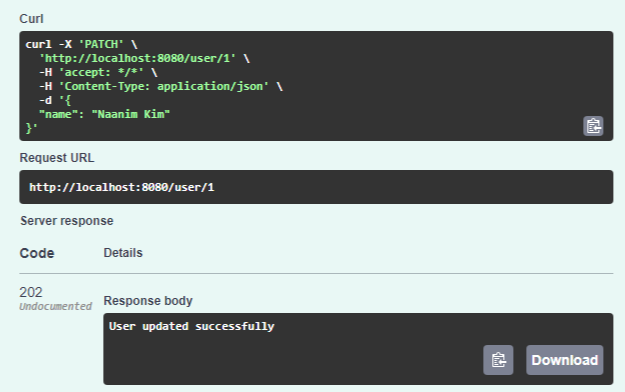
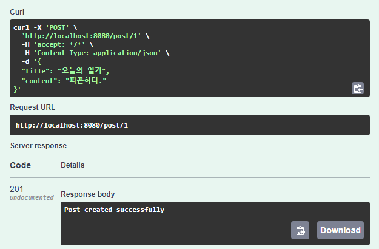
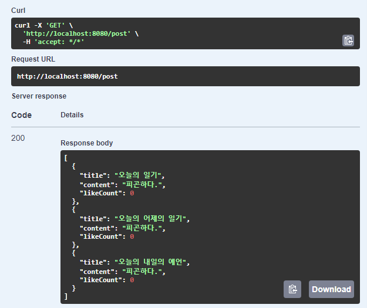
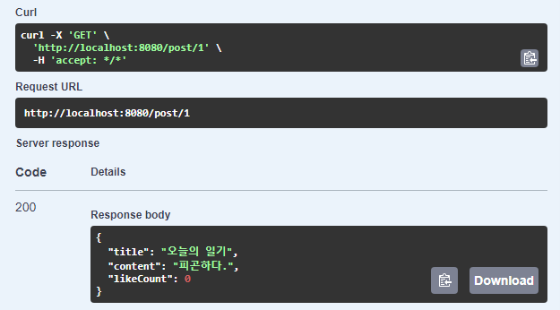
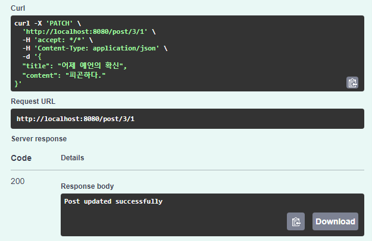
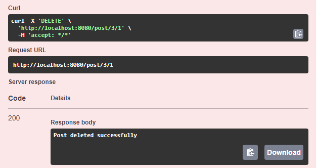
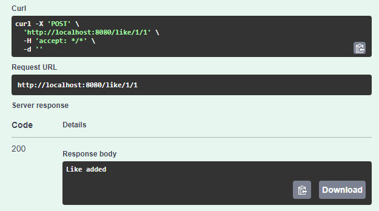

# 💻 간단한 블로그 플렛폼 API

## 기능:

1. **[유저 관리](#1-user-feature-testing)**
  - **유저 추가**
  - **유저 조회**
  - **유저 정보 엡데이트**
  - **유저 삭제**

2. **[계시글 관리](#2-post-feature-testing)**
  - **계시글 작성**
  - **하눈에 모든 계시글 보기**
  - **ID 로 계시글 불러오기**
  - **계시글 수정**
  - **계시글 삭제**

3. **[좋아요 기능](#3-like-feature-testing)**
  - **좋아요 토글** (Users can like or unlike a post)
  - **Retrieve Like Count** (See the total number of likes for each post)

### Swagger 화룡앟여 test 하기
'http://localhost:8080/swagger-ui/index.html#/'

---

## 1. **User Feature Testing**

<table>
<tr>
<td>
  
#### a. **유저 추가하기r**
- **Endpoint**: `POST /user`
- **Try it out json**:
 
     ```json 
     {
       "name": "Naim Kim"
     }
     ```
  - **Results 👉👉👉**

</td>
<td>



</td>
</tr>

<tr>
<td>

#### b. **유저 조회하기 by ID**

- **Endpoint**: `GET /user/{userId}`
- **Try it out**.
  - Execute with a valid `userId`.
- **Results 👉👉👉**

</td>
<td>



</td>
</tr>

<tr>
<td>

#### c. **유저 정보 엡데이트**

- **Endpoint**: `PATCH /user/{userId}`
- **Try it out json**.
     ```json
     {
       "name": "Naanim Kim"
     }
     ```
- **Results 👉👉👉**

</td>
<td>



</td>
</tr>
</table>

---

## 2. **Post Feature Testing**

<table>
<tr>
<td>

#### a. **Create a Post**

- **Endpoint**: `POST /post/{userId}`
- **Try it out json**.
     ```json
     {
       "title": "오늘의 일기",
       "content": "피곤하다."
     }
     ```
- **Results 👉👉👉**

</td>
<td>



</td>
</tr>

<tr>
<td>

#### b. **하눈에 모든 계시글 보기**

- **Endpoint**: `GET /post`
- **Results 👉👉👉**

</td>
<td>



</td>
</tr>

<tr>
<td>

#### c. **ID 로 계시글 불러오기**

- **Endpoint**: `GET /post/{postId}`
- **Execute**.
- **Results 👉👉👉**

</td>
<td>



</td>
</tr>

<tr>
<td>

#### d. **Update a Post**

- **Endpoint**: `PATCH /post/{postId}/{userId}`
- **Try it out json**.
     ```json
     {
       "title": "어제 예언의 확신",
       "content": "피곤하다."
     }
     ```
- **Results 👉👉👉**

</td>
<td>



</td>
</tr>

<tr>
<td>

#### e. **Delete a Post**

- **Endpoint**: `DELETE /post/{postId}/{userId}`
- Select wnated post and Execute.
- **Results 👉👉👉**

</td>
<td>



</td>
</tr>

</table>

---

## 3. **Like Feature Testing**

<table>
<tr>
<td>

#### a. **Toggle Like on a Post**

- **Endpoint**: `POST /like/{postId}/{userId}`
- Enter postId and userId to toggle like
- **Results 👉👉👉**

</td>
<td>



다시 "누른다면"

</td>
</tr>
</table>

---
